Avoiding Parking Tickets in Vancouver, B.C.
========================================================
### Jonathan Baik
### STAT 545A Homework 6
### Oct 22 2013 1:21:56 AM
<hr>

> All the data and code for this project is on my [Github](https://github.com/jonnybaik/stat545a-2013-hw06_baik-jon). All plots in `png` format can be found in my [imgur gallery](http://imgur.com/a/kch1b).

## Changelog

```
2013-10-21 12:00 PM:
  Initial hand in version.
  
2013-10-21 02:00 PM:
  Fixed some plots, added colour to existing plots.
  
2013-10-22 01:00 AM:
  Added maps and conclusions. Updated MAKEFILE.R
```

## Contents
* The Data
* Data Cleaning
* Different Types of Parking Offences
* Types of Cars that Were Ticketed
* When to Avoid Parking in Vancouver
* Aren't the Holidays Nice?
* Repeat Offenders
* Most Ticketed Locations
* Conclusions


## The Data

I investigate a data set containing all municipal parking tickets issued in the city of Vancouver between January 1, 2004 and September 25, 2008. The data set originates from [The Vancouver Sun's website](http://www.vancouversun.com/parking/basic-search.html) where a web interface is provided for the interested reader to query the database. There was no way to easily download the data from the source, so I obtained a dump of the entire database from the website of a local Vancouver programmer, David Grant, who kindly links to the file on his [website](http://www.davidgrant.ca/vancouver_sun_parking_tickets_website_screen_scraper) along with [the code](https://github.com/dgrant/vancouver-parking-tickets) used to scrape the data from the source website.

Note that this data set only contains parking offences issued by the city of Vancouver, but does not contain data on fines received in off-street private or public parking lots.

I chose this data set because I wanted to delve into some local data that might be useful for us "Vancouverites". Also, this data set is pretty sizeable, containing information on 1.6 million parking tickets issued in Vancouver. Maybe we will be able to find something interesting that will help us to avoid parking tickets?

## Data Cleaning

The data set extracted from David Grant's data base dump was already quite clean. We load the data and check its dimensions and structure to verify that nothing went horribly wrong. Note that due to the size of the data, I saved a `rds` binary copy of the data set.


```r
# Read in the data
ptDat <- readRDS("../data_01_raw/parkingtickets.rds")
```


We have 1.6 million rows and 15 columns. We go through some additional cleaning steps before we begin our analysis:

1. Drop unneeded variables (e.g. variables full of `NA`s)
2. Convert the variables to useful types that are easy to work with in `R` (e.g. `POSIX` date variables, set time zones, convert to factors, etc.)
3. Create extra variables that might be helpful during data aggregation/analysis (e.g. separate variables for `year`, `month`, `day`, `hour`, etc.)
4. Order factor levels
5. Bin some categories in existing variables (e.g. combine categories that contain few observations into a new category called "Other")

After some light data cleaning and processing, we check the structure of the data:


```r
# Verify that the data set was read properly Check dimensions
dim(ptDat)
```

```
## [1] 1631387      17
```

```r
# Check structure
str(ptDat)
```

```
## 'data.frame':	1631387 obs. of  17 variables:
##  $ datetime      : POSIXct, format: "2004-01-02 07:08:00" "2004-01-02 07:09:00" ...
##  $ date          : POSIXct, format: "2004-01-02" "2004-01-02" ...
##  $ time          : chr  "07:08:00" "07:09:00" "07:11:00" "07:14:00" ...
##  $ plate         : chr  "661DEL" "A87433E" "061JJK" "NJR688" ...
##  $ make_denorm   : Factor w/ 115 levels "DELOREAN","EDSEL",..: 107 113 107 108 113 102 112 95 114 97 ...
##  $ address       : chr  "1250 Broadway St. W." "1450 Davie St." "1350 Davie St." "1650 Davie St." ...
##  $ street_num    : int  1250 1450 1350 1650 850 650 1650 1350 1350 1550 ...
##  $ street_name   : chr  "Broadway St. W." "Davie St." "Davie St." "Davie St." ...
##  $ offence_denorm: Factor w/ 16 levels "Park too far away from curb",..: 15 15 15 15 15 15 15 15 15 15 ...
##  $ make_denorm2  : Factor w/ 80 levels "Other","AUSTIN",..: 72 78 72 73 78 67 77 60 79 62 ...
##  $ year          : num  2004 2004 2004 2004 2004 ...
##  $ month         : num  1 1 1 1 1 1 1 1 1 1 ...
##  $ day           : int  2 2 2 2 2 2 2 2 2 2 ...
##  $ wday          : Ord.factor w/ 7 levels "Sunday"<"Monday"<..: 6 6 6 6 6 6 6 6 6 6 ...
##  $ hour          : int  7 7 7 7 7 7 7 7 7 7 ...
##  $ holiday       : logi  FALSE FALSE FALSE FALSE FALSE FALSE ...
##  $ holiday_name  : Factor w/ 9 levels "New Years","Good Friday",..: NA NA NA NA NA NA NA NA NA NA ...
```

```r
# The variable names
names(ptDat)
```

```
##  [1] "datetime"       "date"           "time"           "plate"         
##  [5] "make_denorm"    "address"        "street_num"     "street_name"   
##  [9] "offence_denorm" "make_denorm2"   "year"           "month"         
## [13] "day"            "wday"           "hour"           "holiday"       
## [17] "holiday_name"
```


## Different Types of Parking Offenses

We begin the data analysis by first examining the different types of parking tickets and the frequency of such tickets. It is of interest to know what kind of behaviours to avoid when parking your car in Vancouver.

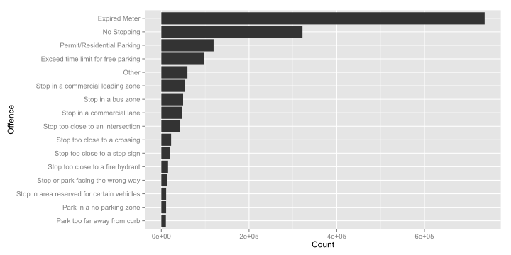

<!-- html table generated in R 3.0.2 by xtable 1.7-1 package -->
<!-- Tue Oct 22 01:22:00 2013 -->
<TABLE border=1>
<TR> <TH>  </TH> <TH> Count </TH> <TH> Proportion </TH>  </TR>
  <TR> <TD align="right"> Expired Meter </TD> <TD align="right"> 737313 </TD> <TD align="right"> 0.4520 </TD> </TR>
  <TR> <TD align="right"> No Stopping </TD> <TD align="right"> 321845 </TD> <TD align="right"> 0.1973 </TD> </TR>
  <TR> <TD align="right"> Permit/Residential Parking </TD> <TD align="right"> 119130 </TD> <TD align="right"> 0.0730 </TD> </TR>
  <TR> <TD align="right"> Exceed time limit for free parking </TD> <TD align="right"> 98167 </TD> <TD align="right"> 0.0602 </TD> </TR>
  <TR> <TD align="right"> Other </TD> <TD align="right"> 59518 </TD> <TD align="right"> 0.0365 </TD> </TR>
  <TR> <TD align="right"> Stop in a commercial loading zone </TD> <TD align="right"> 52888 </TD> <TD align="right"> 0.0324 </TD> </TR>
  <TR> <TD align="right"> Stop in a bus zone </TD> <TD align="right"> 49637 </TD> <TD align="right"> 0.0304 </TD> </TR>
  <TR> <TD align="right"> Stop in a commercial lane </TD> <TD align="right"> 46921 </TD> <TD align="right"> 0.0288 </TD> </TR>
  <TR> <TD align="right"> Stop too close to an intersection </TD> <TD align="right"> 43064 </TD> <TD align="right"> 0.0264 </TD> </TR>
  <TR> <TD align="right"> Stop too close to a crossing </TD> <TD align="right"> 22309 </TD> <TD align="right"> 0.0137 </TD> </TR>
  <TR> <TD align="right"> Stop too close to a stop sign </TD> <TD align="right"> 19066 </TD> <TD align="right"> 0.0117 </TD> </TR>
  <TR> <TD align="right"> Stop too close to a fire hydrant </TD> <TD align="right"> 15334 </TD> <TD align="right"> 0.0094 </TD> </TR>
  <TR> <TD align="right"> Stop or park facing the wrong way </TD> <TD align="right"> 14014 </TD> <TD align="right"> 0.0086 </TD> </TR>
  <TR> <TD align="right"> Stop in area reserved for certain vehicles </TD> <TD align="right"> 10972 </TD> <TD align="right"> 0.0067 </TD> </TR>
  <TR> <TD align="right"> Park in a no-parking zone </TD> <TD align="right"> 10884 </TD> <TD align="right"> 0.0067 </TD> </TR>
  <TR> <TD align="right"> Park too far away from curb </TD> <TD align="right"> 10325 </TD> <TD align="right"> 0.0063 </TD> </TR>
   </TABLE>


It seems the number one reason for receiving parking tickets in Vancouver is from expired parking meters. The next two most common reasons for receiving a parking tickets seem to arise from drivers wanting to avoid parking meters all together. Drivers that park their cars in a "No Stopping Zone" and drivers that parked in other people's permit/residential accounted for more than a quarter of the parking tickets in the data set. I guess that goes to show that you should always be mindful of how much money you put into the meter, and if you run out of change, you best not push your luck!

Let's check out the frequency of each othe offences by month over the time period of our data.

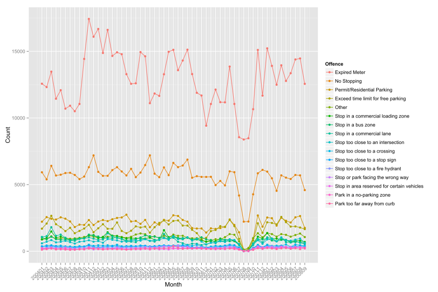

It appears that the monthly number of tickets issued for each offence is quite stable. There is no immediate trend present in the plot. However, we see some unusual activity around August, 2007 there is a sharp decline in the number of tickets issued in Vancouver, but quickly recovers to "normal" levels in a couple of months. I wonder if there was a strike during that time period?

## Types of Cars that Were Ticketed

Now we focus our attention to the cars! We have information about the make (i.e. manufacturer) of the car attached to each parking ticket. This may not be terribly descriptive since the model or year is not recorded (e.g. a 1980 Honda Civic is recorded the same way as a 2014 Honda Pilot), but we may see that owners of differernt car brands may have different parking behaviours.

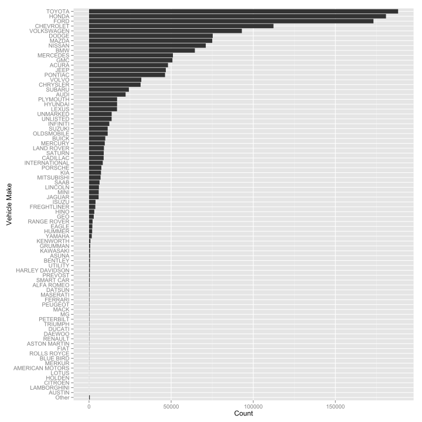

There are 115 different makes of vehicles recorded in the data set, so we do not include a table of counts with this figure. Note that in the above figure, we group some of the 115 makes of cars into a category labelled `Other` to keep the figure readable.

Not much can be said relating to parking tickets from this plot per se. We are most likely seeing which cars are most common in Vancouver from our preceding figure. In the recording period of our data set, it was probably the case that the most common cars in Vancouver were Hondas, Toyotas and Fords. It is probably not the case that roadside deviants are more likely to drive Toyotas, Hondas and Fords. In any case, we cannot say with our figure.

We can try to see if there are any noticeable differences in parking habits for people who drive different makes of cars by colouring the above plot by the ticket type.

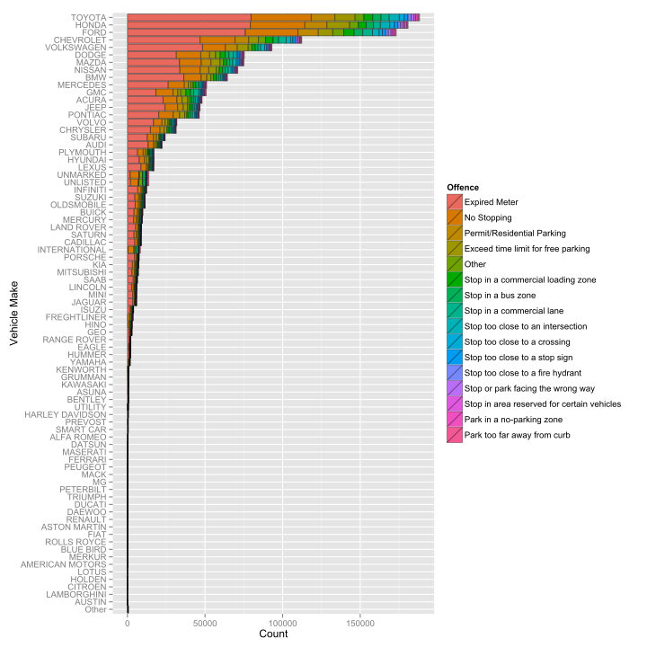

It is hard to tell whether drivers of a certain car type are more likely to commit some offences over others in the above plot. We show a similar plot below, this time with stacked bars that describe the proportion of each offence for each car make.

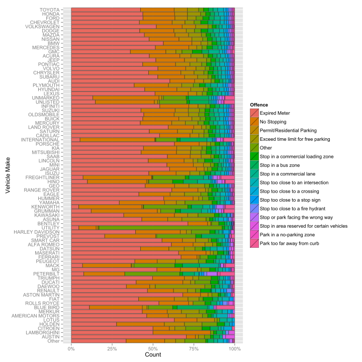

If we take a quick look at this figure, the "Expired Meter" offence seems to be the most likely reason for receiving a parking ticket. But if we look a little closer, we see a handful of cars that have a relatively larger proportion of parking tickets received due to parking in "No Stopping" zones. These cars are usually unknown or unbranded types of cars (e.g. UNMARKED, UNLISTED, INTERNATIONAL, etc.), or some build of car that I am not familiar with (e.g. FREGHTLINER, HINO, KENWORTH, etc.). I hypothesize that very important visitors, such as diplomats or VIPs with chauffeurs, are the the types of people who drive (or are driven in) these types of unmarked cars. Another interesting make of car is the UTILITY vehicle. Drivers that drive UTILITY vehicles seem to receive many "OTHER" parking tickets. One can only guess what this means. Maybe drivers of UTILITY vehicles like to break things as they park their giant cars?

## When to Avoid Parking in Vancouver

Another interesting question is **when** should we be careful with our parking here in Vancouver? Are there certain months or days or times during the day that we should avoid? Are people more prone to receiving tickets during the weekend? During holidays?

We first take a broad look at the data. We Look at the yearly totals:

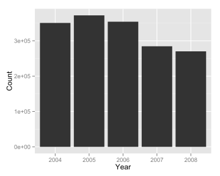

It looks like the number of parking tickets given out peaked in 2005 and then experienced a steady decline up to 2008. However, this is a little misleading, since the data ranges from January 1, 2004 to September 25, 2008. During the final year of our data set, we have 3 fewer months of data compared to the other years. Also, as we will see in our next few plots, there is something strange with the data in 2007.

Let us take a look at the monthly totals for the range of our data set. We display the same data with bar plots and with a line chart.

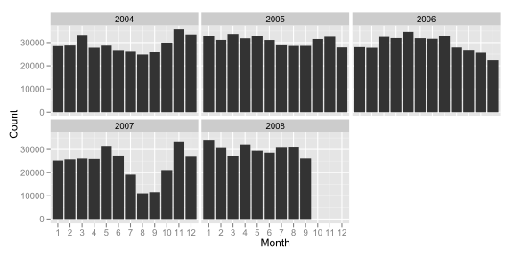

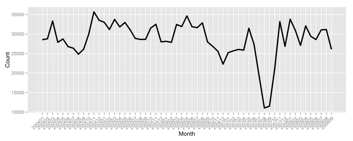

The bar plots and the line charts show the same picture. We focus on the line chart. We seem to be seeing around 30000 parking tickets per month, with some random(?) peaks and troughs (which are exaggerated in the line chart due to the y axis starting at 10000), but suddenly see a great drop in the number of parking tickets issued in 2007 starting in July and lasting until around October before reaching "normal" levels again in November of that year. Doing a quick search in Google did not yield any ideas as to why this occurred. Maybe the appointment of the new police chief, Jim Chu, reminded everyone to follow the law more closely during these months (though, probably not). It would be interesting to find what caused this to occur.

Now we look at which months experienced the larged number of parking tickets in our data set. If we take a look at monthly totals, it appears that May is the worst time to risk a parking infraction, while October seems to be a good time to park without putting money in the parking meter.

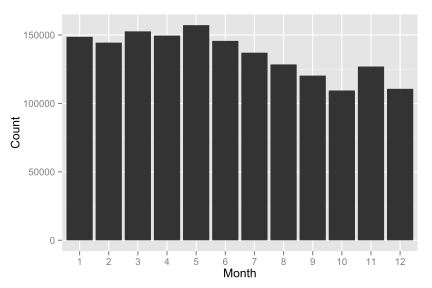

However, if we correct for the fact that we do not have data for October, November, or December in 2008, we see a different picture. We take the monthly means and plot below:

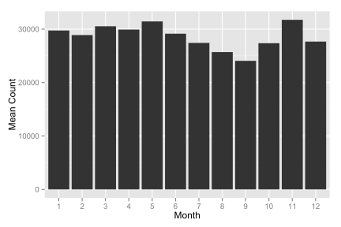

Now it appears that November is the riskiest month to park illegally. In fact, July, August and September are probably not good months to park either due to that anomoly observed in 2007. 

However, there may still be a ray of hope for the reader looking to park for free (albeit wrongfully) at the meter. If we take a look at parking tickets by days of the week and by holidays, we can see that parking enforcement officers may be more strict on some days than others. Let us take a look at the overall parking ticket count by day of the week.

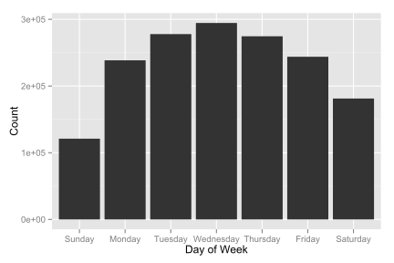

Sunday experiences the lowest number of parking tickets handed out, followed by Saturday. Then we see a unimodal-like distribution of parking tickets handed out during Monday to Friday, peaking on Wednesday (maybe parking officers are grumpy on hump day?). The low number of tickets on Sunday and Saturday is probably due to weekend parking rules where some areas are free to park only on weekends. In addition, some meters in some locations may be free to park on weekends, and there may be fewer parking officers working during the weekends.

Let us take a look at the proportion of tickets given on each day of the week facetted by offence. It will be apparent that the distributions are roughly similar. It seems that Sunday is the best time to go out and park in Vancouver with the least worry of parking receiving parking tickets (except maybe for your expired meter).

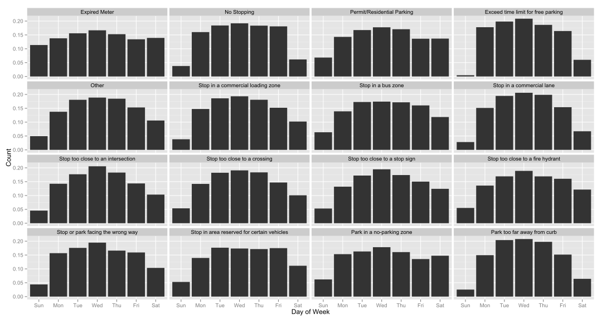

Now we will take a look at what times are best for parking. We created an `hour` variable in the data set to get an idea of which times are bad for parking.

We try looking at the number of parking tickets by hour. Then we will check if the distribution is similar for every day of the week, and then we will see if certain types of offences are committed at different hours of the day.

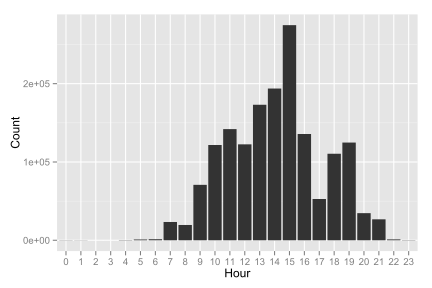

Perhaps the time when we should be most mindful of our vehicles is around 3:00 PM. The largest number of parking tickets are given out around this time. This pattern persists for all days of the week.

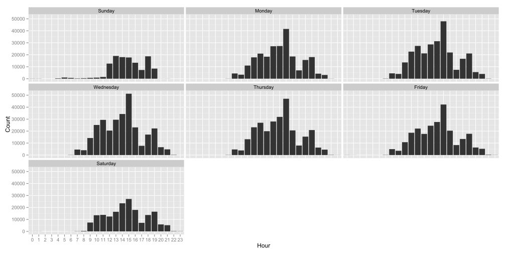

Now, we take a look at the proportion of tickets given out during a specific time given the offence. It appears that different offences have different peak times of getting caught. In particular, we have a very strange distribution for the "No Stopping" offence - 3:00 PM is the peak time for giving out tickets for parking or stopping in a "No Stopping" zone.

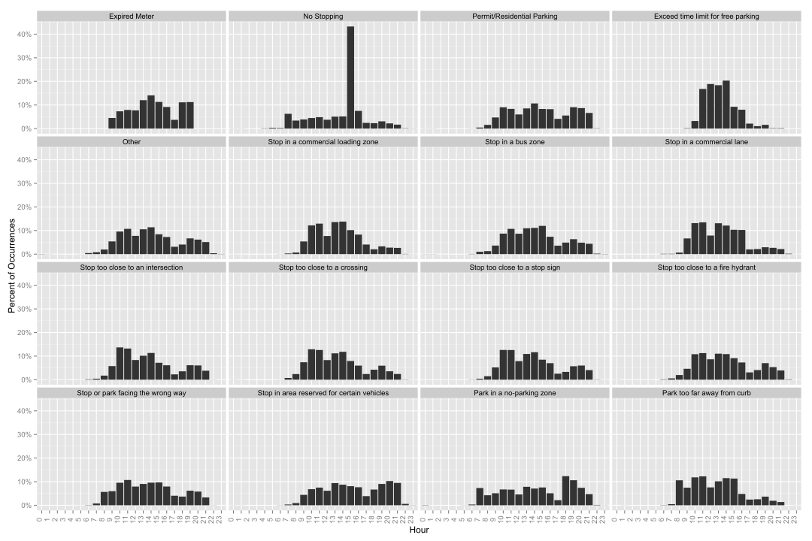

> Sorry for the rotated x-axis labels. The labels would overlap otherwise!

We zoom in to the "No Stopping" plot from the above plot.

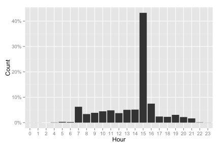

Next, we look at parking during the holidays!

## Aren't the Holidays Nice?

Next we will check the parking tickets data during the holidays. We consider the [9 statutory holidays we have in B.C.](http://www.labour.gov.bc.ca/esb/facshts/stats.htm): New Year's, Good Friday, Victoria Day, Canada Day, B.C. Day, Labour Day, Thanksgiving Day, Remembrance Day, and Christmas Day (this data was before the creation of Family Day).

Presumably, people have more time to drive around during the holidays. Will we see fewer, or more parking violations during the holidays? We can see the number of parking tickets given during each holday in the range of the data set. To have a point of comparison, we also plot the overall mean daily number of parking tickets (black), the weekday mean number (blue), and the weekend mean number (red).

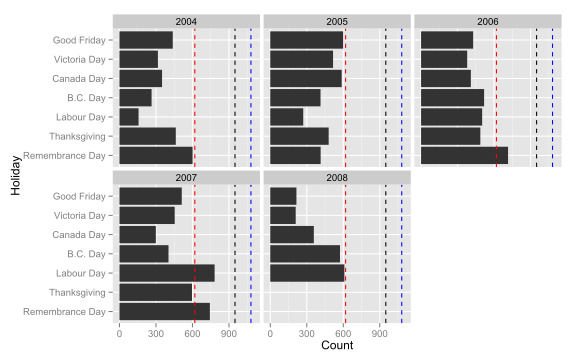

It seems that during statutory holidays, we experience fewer parking tickets, below even the Weekend mean value (red dashed line), except in 2006 and 2007 for a couple of the holidays. During all the holidays, we see fewer parking tickets handed out compared to the average. Again, this is may due to parking enforcement officers taking a day off. 

## Repeat Offenders

As they say, "Catch me once, shame on you... catch me twice, shame on me". A parking fine is supposed to be a deterrent that stops people from parking illegally. Apparently, this is not effective for some people.

If we take a histogram of the number of parking tickets issued to each license plate in the data base, we see a highly skewed distribution, where most of the mass is on 1. The fast majority of license plates in the data set have only 1 parking ticket associated with it.

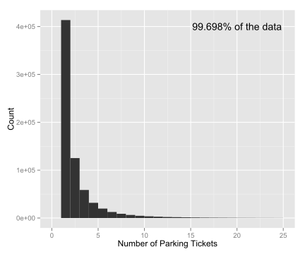

The keen observer will notice that only 99.689% of the data is displayed in the histogram. What happened to the remaining 0.302% of the data? We show the top 25 offenders in the table below.

<!-- html table generated in R 3.0.2 by xtable 1.7-1 package -->
<!-- Tue Oct 22 01:22:01 2013 -->
<TABLE border=1>
<TR> <TH> Plate </TH> <TH> Make </TH> <TH> No. Tickets </TH>  </TR>
  <TR> <TD> 0287GE </TD> <TD> INTERNATIONAL </TD> <TD align="right"> 362 </TD> </TR>
  <TR> <TD> 1802EY </TD> <TD> INTERNATIONAL </TD> <TD align="right"> 339 </TD> </TR>
  <TR> <TD> 0652AH </TD> <TD> INTERNATIONAL </TD> <TD align="right"> 306 </TD> </TR>
  <TR> <TD> 1196GJ </TD> <TD> MERCEDES </TD> <TD align="right"> 229 </TD> </TR>
  <TR> <TD> 7962TM </TD> <TD> UNMARKED </TD> <TD align="right"> 223 </TD> </TR>
  <TR> <TD> 540HCL </TD> <TD> BENTLEY </TD> <TD align="right"> 204 </TD> </TR>
  <TR> <TD> 6773NS </TD> <TD> FORD </TD> <TD align="right"> 200 </TD> </TR>
  <TR> <TD> 1191GJ </TD> <TD> MERCEDES </TD> <TD align="right"> 197 </TD> </TR>
  <TR> <TD> 474KEF </TD> <TD> VOLKSWAGEN </TD> <TD align="right"> 188 </TD> </TR>
  <TR> <TD> 9531BA </TD> <TD> UNMARKED </TD> <TD align="right"> 174 </TD> </TR>
  <TR> <TD> 9842FB </TD> <TD> INTERNATIONAL </TD> <TD align="right"> 173 </TD> </TR>
  <TR> <TD> KSD207 </TD> <TD> BMW </TD> <TD align="right"> 172 </TD> </TR>
  <TR> <TD> 772KEA </TD> <TD> MERCEDES </TD> <TD align="right"> 165 </TD> </TR>
  <TR> <TD> 0117DF </TD> <TD> INTERNATIONAL </TD> <TD align="right"> 152 </TD> </TR>
  <TR> <TD> 1193GJ </TD> <TD> MERCEDES </TD> <TD align="right"> 151 </TD> </TR>
  <TR> <TD> 119ACC </TD> <TD> JEEP </TD> <TD align="right"> 149 </TD> </TR>
  <TR> <TD> 4581PY </TD> <TD> UNMARKED </TD> <TD align="right"> 147 </TD> </TR>
  <TR> <TD> INCMPT </TD> <TD> FORD </TD> <TD align="right"> 144 </TD> </TR>
  <TR> <TD> 6617HK </TD> <TD> UNLISTED </TD> <TD align="right"> 141 </TD> </TR>
  <TR> <TD> 627FKR </TD> <TD> VOLKSWAGEN </TD> <TD align="right"> 140 </TD> </TR>
  <TR> <TD> AXN571 </TD> <TD> BMW </TD> <TD align="right"> 140 </TD> </TR>
  <TR> <TD> 8598HS </TD> <TD> UNMARKED </TD> <TD align="right"> 138 </TD> </TR>
  <TR> <TD> 982CXC </TD> <TD> HONDA </TD> <TD align="right"> 137 </TD> </TR>
  <TR> <TD> 180KJM </TD> <TD> MERCEDES </TD> <TD align="right"> 135 </TD> </TR>
  <TR> <TD> 2538AY </TD> <TD> UNMARKED </TD> <TD align="right"> 130 </TD> </TR>
   </TABLE>


There is a handful of people who accrue a lot of fines from parking tickets. If a parking ticket were $30, these owners would be paying in excess of $3000 in just parking tickets! However, if we shift through the data, we have a number of cars (>1000) with license plates marked as "INCMPT" - probably meaning "Incompatible" or "Incomplete". These may be foreign cars or cars with custom license plates that cannot be enterd into the system properly.

## Most Ticketed Locations

Finally, we will check which areas receive the largest number of parking tickets in the City of Vancouver. Looking through the data set, it appears that the address variable is accurate to a 100 block. In other words, all parking tickets issued on 1000 Robson St. to 1100 Robson street will marked as 1050 Robson St. in the data. We display the top 25 worst places to park in Vancouver.

<!-- html table generated in R 3.0.2 by xtable 1.7-1 package -->
<!-- Tue Oct 22 01:22:01 2013 -->
<TABLE border=1>
<TR> <TH> Address </TH> <TH> No. Tickets </TH>  </TR>
  <TR> <TD> 1050 Robson St. </TD> <TD align="right"> 17899 </TD> </TR>
  <TR> <TD> 1150 Robson St. </TD> <TD align="right"> 15674 </TD> </TR>
  <TR> <TD> 850 Hornby St. </TD> <TD align="right"> 10501 </TD> </TR>
  <TR> <TD> 650 Broadway St. W. </TD> <TD align="right"> 10426 </TD> </TR>
  <TR> <TD> 1050 Alberni St. </TD> <TD align="right"> 9729 </TD> </TR>
  <TR> <TD> 1750 Broadway St. W. </TD> <TD align="right"> 9121 </TD> </TR>
  <TR> <TD> 1050 Hornby St. </TD> <TD align="right"> 9100 </TD> </TR>
  <TR> <TD> 650 Hornby St. </TD> <TD align="right"> 8863 </TD> </TR>
  <TR> <TD> 1050 Mainland St </TD> <TD align="right"> 8328 </TD> </TR>
  <TR> <TD> 1050 Homer St. </TD> <TD align="right"> 8269 </TD> </TR>
  <TR> <TD> 1150 Hamilton St. </TD> <TD align="right"> 8094 </TD> </TR>
  <TR> <TD> 850 Howe St. </TD> <TD align="right"> 7941 </TD> </TR>
  <TR> <TD> 850 Broadway St. W. </TD> <TD align="right"> 7848 </TD> </TR>
  <TR> <TD> 2250 4th Ave W. </TD> <TD align="right"> 7634 </TD> </TR>
  <TR> <TD> 950 Hornby St. </TD> <TD align="right"> 7462 </TD> </TR>
  <TR> <TD> 1950 4th Ave W. </TD> <TD align="right"> 7403 </TD> </TR>
  <TR> <TD> 2650 Granville St. </TD> <TD align="right"> 7354 </TD> </TR>
  <TR> <TD> 1650 Broadway St. W. </TD> <TD align="right"> 7062 </TD> </TR>
  <TR> <TD> 1350 Broadway St. W. </TD> <TD align="right"> 6961 </TD> </TR>
  <TR> <TD> 1150 Broadway St. W. </TD> <TD align="right"> 6903 </TD> </TR>
  <TR> <TD> 1050 Hamilton St. </TD> <TD align="right"> 6889 </TD> </TR>
  <TR> <TD> 950 Broadway St. W. </TD> <TD align="right"> 6821 </TD> </TR>
  <TR> <TD> 150 Davie St. </TD> <TD align="right"> 6676 </TD> </TR>
  <TR> <TD> 1150 Homer St. </TD> <TD align="right"> 6658 </TD> </TR>
  <TR> <TD> 1150 Mainland St </TD> <TD align="right"> 6562 </TD> </TR>
   </TABLE>


It looks like Downtown Vancouver, and parts of Broadway St. are the hottest places to be for parking enforcement officers! Let us take a look on the map where these are:

<!-- Map generated in R 3.0.2 by googleVis 0.4.5 package -->
<!-- Tue Oct 22 01:22:01 2013 -->


<!-- jsHeader -->
<script type="text/javascript">
 
// jsData 
function gvisDataMapID29c0783d4f81 () {
var data = new google.visualization.DataTable();
var datajson =
[
 [
 49.2838097,
-123.1238556,
"Rank: 1<BR>Address: 1050 Robson St.<BR>Number of tickets: 17899" 
],
[
 49.2851753,
-123.1259842,
"Rank: 2<BR>Address: 1150 Robson St.<BR>Number of tickets: 15674" 
],
[
 49.2817116,
-123.1228333,
"Rank: 3<BR>Address: 850 Hornby St.<BR>Number of tickets: 10501" 
],
[
 49.2623367,
-123.090065,
"Rank: 4<BR>Address: 650 Broadway St. W.<BR>Number of tickets: 10426" 
],
[
 49.2846603,
-123.1232986,
"Rank: 5<BR>Address: 1050 Alberni St.<BR>Number of tickets: 9729" 
],
[
 49.2621231,
-123.0686722,
"Rank: 6<BR>Address: 1750 Broadway St. W.<BR>Number of tickets: 9121" 
],
[
 49.2799988,
-123.1255035,
"Rank: 7<BR>Address: 1050 Hornby St.<BR>Number of tickets: 9100" 
],
[
 49.2841492,
-123.1192322,
"Rank: 8<BR>Address: 650 Hornby St.<BR>Number of tickets: 8863" 
],
[
 49.2759705,
-123.1196518,
"Rank: 9<BR>Address: 1050 Mainland St<BR>Number of tickets: 8328" 
],
[
 49.2766495,
-123.1205673,
"Rank: 10<BR>Address: 1050 Homer St.<BR>Number of tickets: 8269" 
],
[
 49.2752647,
-123.1218262,
"Rank: 11<BR>Address: 1150 Hamilton St.<BR>Number of tickets: 8094" 
],
[
 49.2812691,
-123.1216431,
"Rank: 12<BR>Address: 850 Howe St.<BR>Number of tickets: 7941" 
],
[
 49.2621384,
-123.0860214,
"Rank: 13<BR>Address: 850 Broadway St. W.<BR>Number of tickets: 7848" 
],
[
 49.2680397,
-123.156311,
"Rank: 14<BR>Address: 2250 4th Ave W.<BR>Number of tickets: 7634" 
],
[
 49.2808418,
-123.124176,
"Rank: 15<BR>Address: 950 Hornby St.<BR>Number of tickets: 7462" 
],
[
 49.2679291,
-123.1491241,
"Rank: 16<BR>Address: 1950 4th Ave W.<BR>Number of tickets: 7403" 
],
[
 49.2621689,
-123.1384277,
"Rank: 17<BR>Address: 2650 Granville St.<BR>Number of tickets: 7354" 
],
[
 49.2621956,
-123.0706787,
"Rank: 18<BR>Address: 1650 Broadway St. W.<BR>Number of tickets: 7062" 
],
[
 49.2622337,
-123.0764618,
"Rank: 19<BR>Address: 1350 Broadway St. W.<BR>Number of tickets: 6961" 
],
[
 49.2622566,
-123.0799866,
"Rank: 20<BR>Address: 1150 Broadway St. W.<BR>Number of tickets: 6903" 
],
[
 49.2763138,
-123.1202545,
"Rank: 21<BR>Address: 1050 Hamilton St.<BR>Number of tickets: 6889" 
],
[
 49.2622948,
-123.0841064,
"Rank: 22<BR>Address: 950 Broadway St. W.<BR>Number of tickets: 6821" 
],
[
 49.2736473,
-123.121048,
"Rank: 23<BR>Address: 150 Davie St.<BR>Number of tickets: 6676" 
],
[
 49.2756004,
-123.1224899,
"Rank: 24<BR>Address: 1150 Homer St.<BR>Number of tickets: 6658" 
],
[
 49.2749138,
-123.1212921,
"Rank: 25<BR>Address: 1150 Mainland St<BR>Number of tickets: 6562" 
] 
];
data.addColumn('number','Latitude');
data.addColumn('number','Longitude');
data.addColumn('string','tip');
data.addRows(datajson);
return(data);
}
 
// jsDrawChart
function drawChartMapID29c0783d4f81() {
var data = gvisDataMapID29c0783d4f81();
var options = {};
options["showTip"] = true;
options["showLine"] = false;
options["enableScrollWheel"] = true;
options["mapType"] = "normal";
options["useMapTypeControl"] = true;

    var chart = new google.visualization.Map(
    document.getElementById('MapID29c0783d4f81')
    );
    chart.draw(data,options);
    

}
  
 
// jsDisplayChart
(function() {
var pkgs = window.__gvisPackages = window.__gvisPackages || [];
var callbacks = window.__gvisCallbacks = window.__gvisCallbacks || [];
var chartid = "map";
  
// Manually see if chartid is in pkgs (not all browsers support Array.indexOf)
var i, newPackage = true;
for (i = 0; newPackage && i < pkgs.length; i++) {
if (pkgs[i] === chartid)
newPackage = false;
}
if (newPackage)
  pkgs.push(chartid);
  
// Add the drawChart function to the global list of callbacks
callbacks.push(drawChartMapID29c0783d4f81);
})();
function displayChartMapID29c0783d4f81() {
  var pkgs = window.__gvisPackages = window.__gvisPackages || [];
  var callbacks = window.__gvisCallbacks = window.__gvisCallbacks || [];
  window.clearTimeout(window.__gvisLoad);
  // The timeout is set to 100 because otherwise the container div we are
  // targeting might not be part of the document yet
  window.__gvisLoad = setTimeout(function() {
  var pkgCount = pkgs.length;
  google.load("visualization", "1", { packages:pkgs, callback: function() {
  if (pkgCount != pkgs.length) {
  // Race condition where another setTimeout call snuck in after us; if
  // that call added a package, we must not shift its callback
  return;
}
while (callbacks.length > 0)
callbacks.shift()();
} });
}, 100);
}
 
// jsFooter
</script>
 
<!-- jsChart -->  
<script type="text/javascript" src="https://www.google.com/jsapi?callback=displayChartMapID29c0783d4f81"></script>
 
<!-- divChart -->
  
<div id="MapID29c0783d4f81"
  style="width: 600px; height: 500px;">
</div>


We will look at the big picture. Where are the most parking tickets handed out? We overlay a hexbin plot over a static map of the City of Vancouver. The areas with high frequency of parking tickets handed out are highlighted in red, while low frequency areas are coloured in black.


It looks like the Downtown area, as well as the Broadway Corridor, W 4th Ave and the Granville/Cambie areas attract bad parkers.

This raises another question. What kind of tickets are given out in different areas of Vancouver? Is it uniformly distributed accross all of Vancouver, or is it more likely to receive certain types of parking tickets in some parts of Vancouver over other regions? We overlay a scatter plot, faceted by type of parking ticket.


> It looks like the stylesheet is shrinking the image, making the text unreadable. Here is a link to the [full resolution image](http://i.imgur.com/oNmmnVu.jpg).

Interestingly, the spatial distributions of the different parking offences differ. The most common kind of parking ticket, "Expired Meter", seems to be concentrated in the Downtown area. This is not surprising, as parking meters are not found everywhere in Vancouver. Parking tickets given for stopping in bus zones are concentrated in major roads where buses travel.

## Conclusions

I had a lot of fun working with the Vancouver parking tickets data set. This data set was much larger than I was used to dealing with in R, and that presented several challenges, such as efficiently aggregating the data for visualizing, and plotting large amounts of data. It was unfortunate that there were no truly quantitative variables in the data set. On the plus side, there was a spatial aspect to the data set, and I was able to get my hands dirty plotting maps. If I had more time, I would investigate some quantitative variables that might be linked to the data, such as the fine amount associated with each parking ticket, and also try to visualize any spatio-temporal trends that may be present.

The greatest lesson that I learned from this project is that cleaning the data and reading in the data for analysis is the most time consuming step. I underestimated the time that it would take to get to actually start plotting the data due to concerns of data quality, converting different file formats, etc. Note to self: start projects earlier!

Although this report is titled "Avoiding Parking Tickets in Vancouver", I do not claim that this report will help you avoid getting parking tickets. Just be smart, and park where you're supposed to, and make sure to pay your dues!

> All the data and code for this project is on my [Github](https://github.com/jonnybaik/stat545a-2013-hw06_baik-jon)
